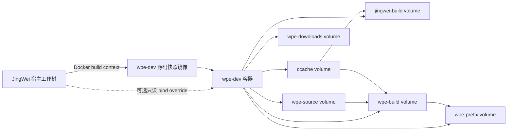
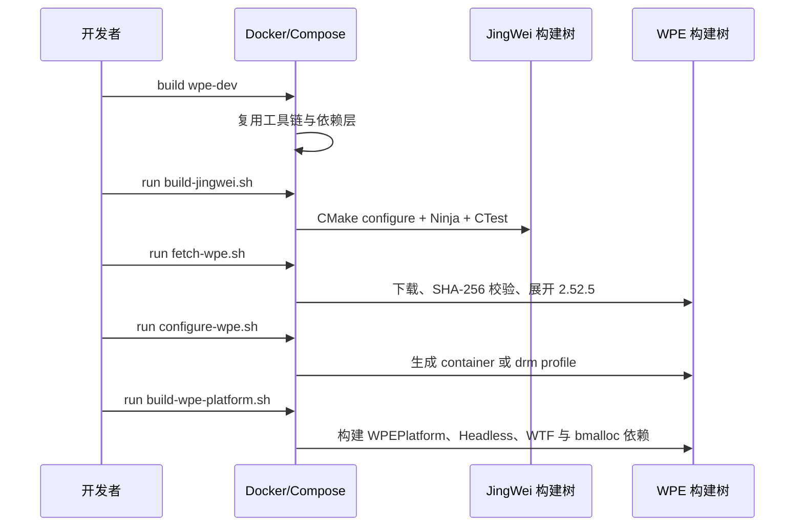

<!--
    JingWei
    docs architecture-review-wpe-container-development.md    2026-07-18

     ______     __  __     ______     ______     __     __
    /\  ___\   /\ \_\ \   /\  ___\   /\___  \   /\ \  _ \ \
    \ \___  \  \ \  __ \  \ \  __\   \/_/  /__  \ \ \/ ".\ \
     \/\_____\  \ \_\ \_\  \ \_____\   /\_____\  \ \__/".~\_\
      \/_____/   \/_/\/_/   \/_____/   \/_____/   \/_/   \/_/.com

    @link    : https://github.com/shezw/JingWei
    @author  : shezw
    @email   : hello@shezw.com
-->

# WPE 容器开发架构复核

## 范围

本文记录当前仓库中 WPE WebKit 2.52.5 与 JingWei 的容器开发结构。内容来自 Dockerfile、Compose 配置、构建脚本和开发说明；尚未存在于仓库中的 JingWei 稳定 ABI、VNC backend 与 WPEPlatform 插件不作为已实现组件描述。

## 组件

| 组件 | 文件 | 当前职责 |
| --- | --- | --- |
| `jingwei-dev` 镜像层 | [Dockerfile](../docker/wpe-dev/Dockerfile) | 提供 Clang、CMake、Ninja、ccache、DRM/GBM/EGL、SDL2、LibVNCServer、libinput 与 xkbcommon 开发工具。 |
| `wpe-dev` 镜像层 | [Dockerfile](../docker/wpe-dev/Dockerfile) | 增加 WPE core 构建依赖、Bubblewrap/DBus proxy、非 root 用户与 JingWei 源码快照。 |
| `wpe-full-dev` 镜像层 | [Dockerfile](../docker/wpe-dev/Dockerfile) | 在 core 之上增加 GStreamer、ATK、Flite、Manette 与 introspection 依赖。 |
| 容器服务 | [compose.yaml](../compose.yaml) | 选择 arm64 平台和镜像 target，设置构建 profile、共享内存、安全选项、loopback 端口及持久化 volumes。 |
| 可选源码 bind | [compose.bind.yaml](../compose.bind.yaml) | 用只读宿主工作树覆盖镜像内源码快照。 |
| JingWei 构建入口 | [build-jingwei.sh](../tools/container/build-jingwei.sh) | 在 named build volume 中执行 CMake、Ninja 和 CTest。 |
| WPE 源码入口 | [fetch-wpe.sh](../tools/wpe/fetch-wpe.sh) | 下载固定版本归档、校验 SHA-256，并展开到 source volume。 |
| WPE 配置入口 | [configure-wpe.sh](../tools/wpe/configure-wpe.sh) | 生成 `container` 或 `drm` profile 的 Ninja build tree。 |
| WPEPlatform 快速构建 | [build-wpe-platform.sh](../tools/wpe/build-wpe-platform.sh) | 配置后只构建 `WPEPlatform` 目标及其依赖。 |
| WPE 全量构建 | [build-wpe.sh](../tools/wpe/build-wpe.sh) | 配置、构建并安装当前 profile 的全部默认目标。 |

## 数据与构建关系

源码快照位于镜像可写层，容器销毁后其修改不保留。高频写入的 JingWei build tree、WPE source/build/prefix、下载文件和编译缓存均使用 Docker named volume。

## 执行顺序

## Profile 差异

| 配置 | `container` | `drm` |
| --- | --- | --- |
| WPEPlatform | 开启 | 开启 |
| Headless | 开启 | 开启 |
| DRM/GBM/libdrm | 关闭 | 开启 |
| Wayland/Qt/legacy API | 关闭 | 关闭 |
| 视频、WebAudio、WebRTC、GStreamer | 关闭 | 使用 WPE 默认与 full 镜像依赖 |
| 运行设备 | 不挂载 `/dev/dri` | Compose 命令显式传入 `/dev/dri` |

## 已记录的显示边界

[开发说明](docker-wpe-development.md)记录了两条显示数据路径：容器开发路径使用 WPEPlatform Headless/SHM，并计划由 JingWei 开发 backend 输出到 LibVNCServer/noVNC；原生 Linux 目标路径使用 DRM、GBM/EGL 与 DMA-BUF。固定下载的 WPE 2.52.5 源码包含前者所需的 SHM 类型，开发镜像包含 LibVNCServer 编译依赖；当前仓库尚未包含二者之间的 JingWei adapter 实现。
